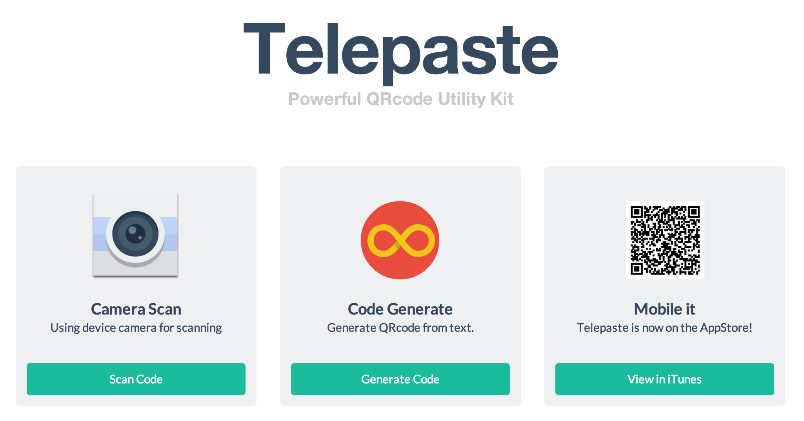
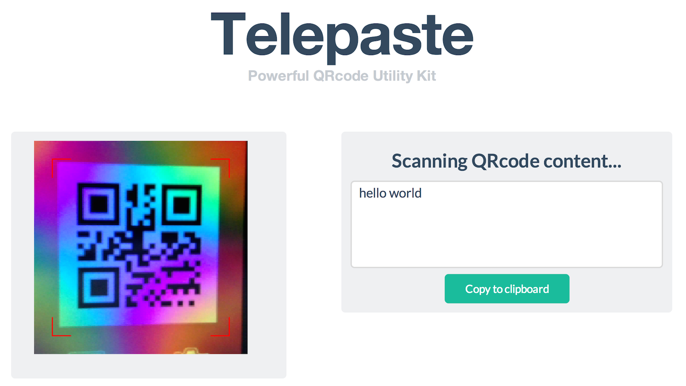

Orbital-TelepasteOnline
=======================

##Telepaste##

Orbital Team: **Undefined**:{Jiang Sheng, Wang Jinghan}

Aimed Level: Gemini

###Ideation###
**What is Telepaste?**

In a word: *** a powerful QR code utility app on modern platform. ***

However, it is not that simple:

For years, people are always seeking a way of fast data exchange between devices. QR code is one of the popular choices these days. That’s why we created Telepaste. It is a smart tool for users who want to exchange short text message like phone numbers or URLs in a fast and elegant way using QR codes.

Telepaste uses QR codes as a media. It is able to capture contents automatically from your clipboard and generate QR code before you open the app. You don't have to press any button to generate the code! Telepaste also supports auto-copying the decoded contents to the clipboard, which will make your life more convenient.

We are now trying to make it an all-platform-supported app.

**Liftoff slides and video?**

It seems that our group has changed our topic (Sorry - -!), so check the slides for team ***Undefined*** if it interests you. 

*(We are behind the Great Fire Wall of China, so maybe you need to jump to the video on Youtube manually)*

**Typical Usage**

*Situation 1*

	Some one send you an URL on your iPhone: you want to open it on your laptop, but you find the URL is too long and complex to type.

*Solution*
	
	1. Copy the link on your phone.
	2. Open Telepaste.
	3. With the auto-generated QRcode, use the Telepate Website to scan the code.
	4. You have the link on your computer now.
	
*Situation 2*

	You make a new friend in a party, but the problem is, how to exchange your contact information in a fast and accurate way?

*Solution*
	
	1. Open Telepaste.
	2. Choose your contact details to generate the QRcode
	3. Scan each other's code.
	4. Invite him/her for dinner next time.

* * *

###Planned Features###
> As a customer, I may be interested in:

> * QRcode Generate
	* Generate code from text (All characters avaliable in UTF-8, numbers, URLs)
	* Generate code from device clipboard
* QRcode Decode
	* Decode from camera scanning
	* Decode from uploaded picture
	* Decode from device clipboard
* Others
	* Lovely and modern UI (Everyone loves Flat!)
	* Save the generated QRcode 
	* One-click-share to your favorite social network
	* NO Wi-Fi/Bluetooth connection needed (Mobile/Mac version only)
	* App Feedback
	* All platform support: iOS, Android (planned), Web, Mac

* * *

###Reference###
***(Updated to June 1st)***

* Web UI
	* [Flat UI](http://designmodo.github.io/Flat-UI/): a Twitter Bootstrap Framework
	* [Dribbble](https://dribbble.com): a great website for finding design element
* Javascript Plugin
	* [jQuery](http://jquery.com): Of course
	* [flexibleArea.js](http://flaviusmatis.github.io/flexibleArea.js/): A jQuery plugin that dynamically updates textarea's height to fit the content
	* [ZeroClipboard](https://github.com/zeroclipboard/zeroclipboard): A library provides and easy way to copy text to the clipboard
	* ***[Jquery.webcamqrcode](http://marcbuils.github.io/jquery.webcamqrcode/)***: Thanks to this brilliant French friend, the web version cannot live without his work. 
* iOS Development
	* [Programming In Objective-C](http://www.amazon.com/Programming-Objective-C-Edition-Developers-Library/dp/0321967607): a must-read book
	* [iOS Programming: The Big Nerd Ranch Guide (4th Edition)](http://www.amazon.com/iOS-Programming-Ranch-Edition-Guides/dp/0321942051/ref=pd_sim_b_1?ie=UTF8&refRID=01B1STJFQQHDFZ25MP59): a useful beginning tutorial
* Others...
	* [Mastering Markdown](https://guides.github.com/features/mastering-markdown/): It's hard to imagine a programmer who doesn't know how to write Markdown document
	* [Github](https://github.com/): I'm Feeling Lucky!

	
* * *

###Project Log###
**Timeline**

1. Web version prototype: by Milestone 1 ***(Currently in development)***
2. Web version Beta finished: By the end of June (around Milestone 2)
3. Mac version prototype: Around Milestone 2
4. Web version Released. Mac Beta (A working copy): Around Milestone 3 

###Prototype and Summary###

For the first month, we mainly did some self-learning stuffs and finalized our idea. We decided to develop the web version for the Telepaste first. And in the past few days, we have developed a working prototype which now could scan QR code using laptop's camera. It needs your browser to support Flash, which is supported by most of modern browsers. 

We tried a Html 5 camera plugin but it doesn't support well for languages like Chinese and Japanese, as well as browsers like IE and Safari. In the next phase, we will finalize the beta version to make it a good QRcode app.

Here are some screen shoot for the prototype:

**Homepage**

**Camera Scan**

* * *

**Thank you for reading this file**